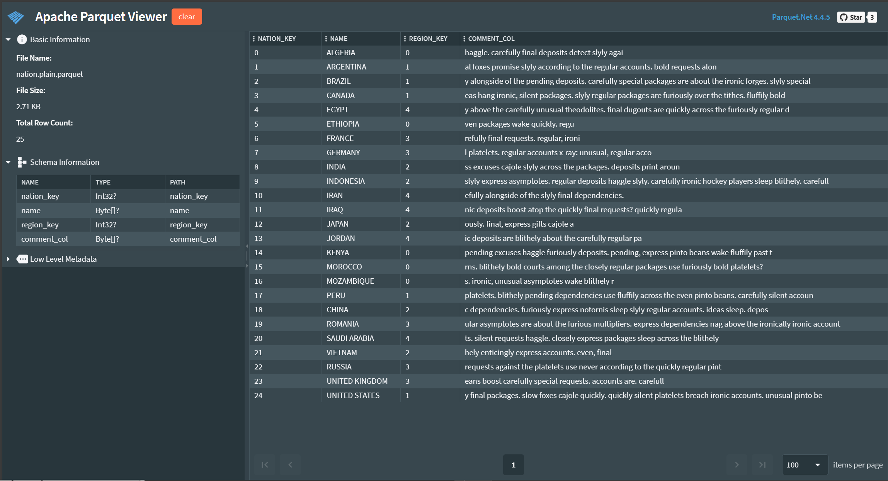

# Parquet Viewer
A very experimental, early stages Parquet Viewer using [Parquet.Net](https://github.com/aloneguid/parquet-dotnet) library. Works fully **offline** without internet connection. None of the files opened are uploaded anywhere.

Parquet Viewer works completely in browser as Web Assembly application.

Hosted at https://parquetdbg.aloneguid.uk/.

Screenshot:

## Features

- View Schema as Parquet.Net sees it.

- Display raw thrift schema
- Display parquet internal structure
- View parquet data

## Roadmap

- View complex types (lists, maps, structs) - some are already supported
- View large files
- Specify options before opening files
