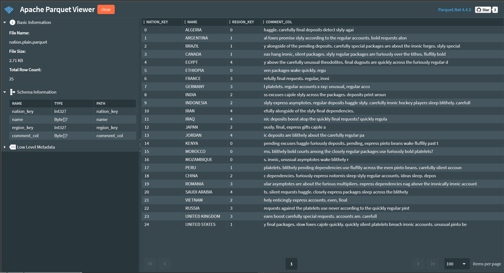

# Parquet Viewer
A very experimental, early stages Parquet Viewer using [Parquet.Net](https://github.com/aloneguid/parquet-dotnet) library. Works fully **offline** without internet connection. None of the files opened are uploaded anywhere.

Parquet Viewer works completely in browser as Web Assembly application.

At the moment is somewhat sluggish due to the way random file access interop between browser and filesystem works, but this will improve dramatically in the future, so feel free to bookmark this page.

Hosted at https://parquetdbg.aloneguid.uk/.

Screenshot:

## Features

- View Schema as Parquet.Net sees it.

- Display raw thrift schema.
- Display parquet internal structure.
- View parquet data.
- View complex types.

## Roadmap

- Specify options before opening files.
- View truly massive files.
